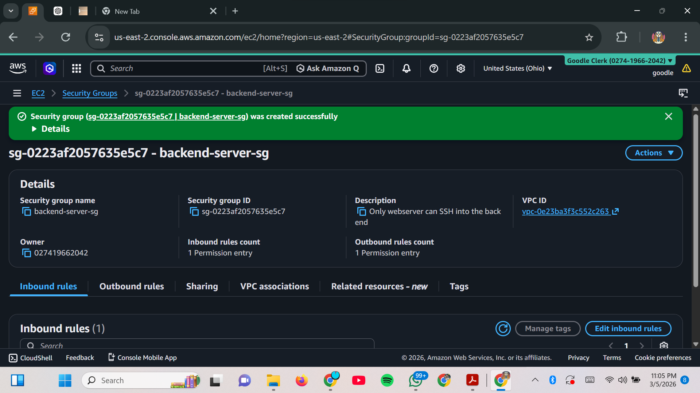
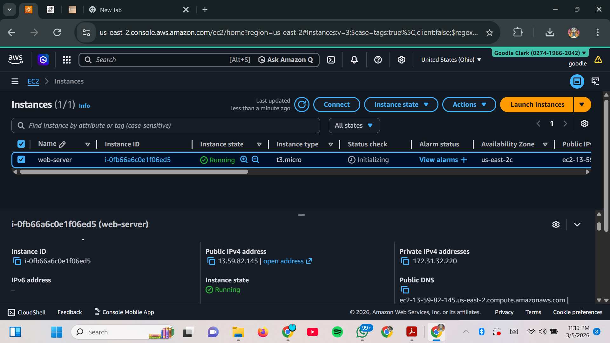
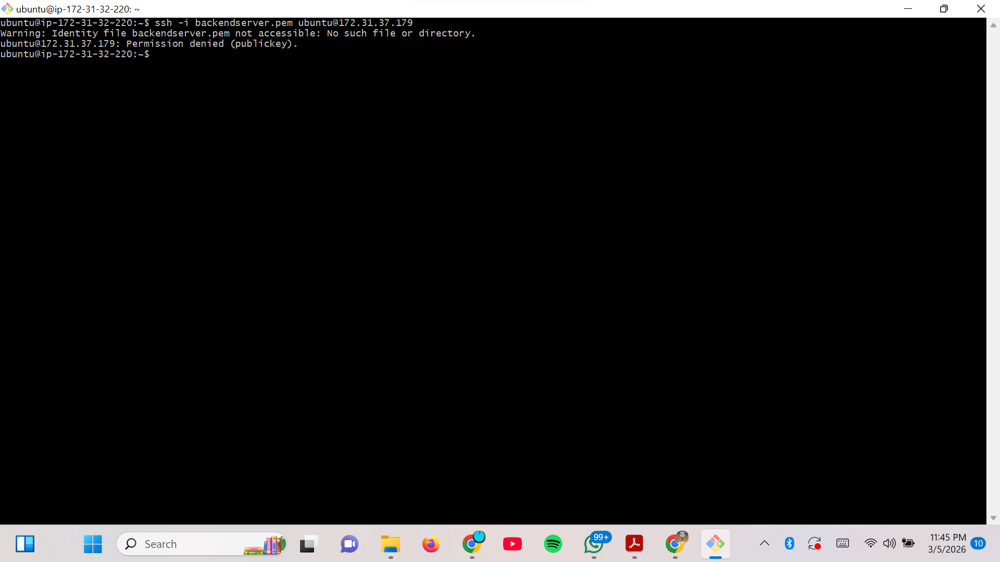
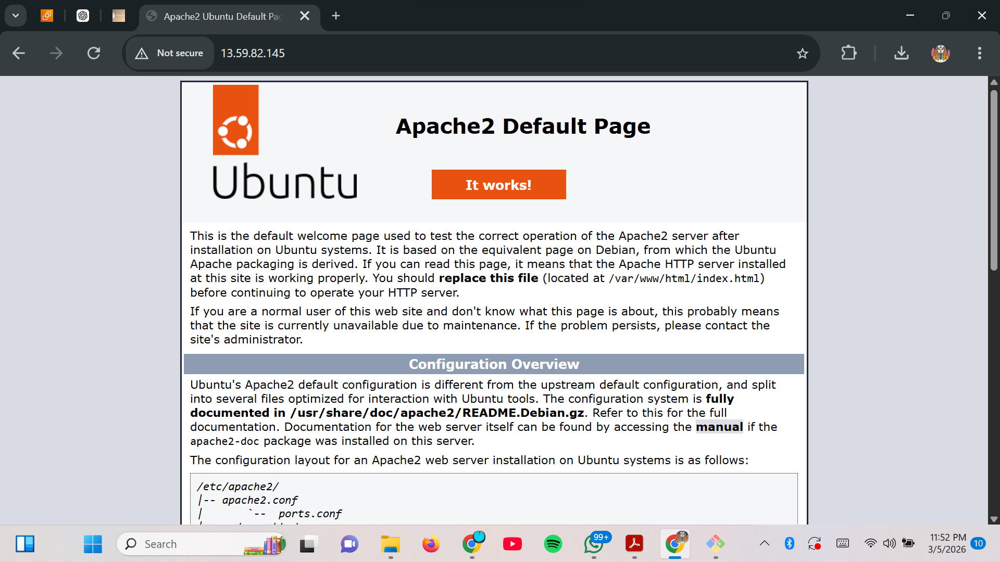

# AWS-Secure-Two-Tier-Architecture
.jpg)


## Table of contents
- [Overview](#project-overview)
- [Architecture Explanation](#architecture)
- [Steps Taken](#implementation-steps)
- [Security Considerations](#security-considerations)

## Project Overview

This project demonstrates the design and deployment of a secure two-tier cloud architecture using Amazon Web Services (AWS). The architecture consists of a public web server and a private backend server to simulate a real-world secure infrastructure.

The goal is to ensure that the backend server remains inaccessible from the internet while still allowing communication from the web server.

---

## Architecture

```
Internet
│
▼
Public EC2 (Web Server)
│
▼
Private EC2 (Backend Server)

The web server is publicly accessible, while the backend server is protected and only accessible through the web server.
```

---

## Technologies Used

- Amazon Web Services (AWS)
- EC2 Instances
- Security Groups
- Ubuntu Server 22.04
- Apache Web Server
- MySQL Database
- SSH

---

## Implementation Steps

### 1. Security Group Configuration

Two security groups were created:

Web Server Security Group:
- HTTP (Port 80) allowed from anywhere
- SSH (Port 22) allowed only from the student's IP


Backend Server Security Group:
- SSH (Port 22) allowed only from the Web Server Security Group


This ensures controlled communication between servers.

---

### 2. EC2 Instance Deployment

Two EC2 instances were launched:

Web Server
- Ubuntu 22.04
- Instance type: t2.micro
- Public IP enabled


Backend Server
- Ubuntu 22.04
- Instance type: t2.micro
- Public IP disabled


---

### 3. Secure Server Access

SSH access was first established to the web server from the local machine. From the web server, SSH was used to access the backend server via its private IP address.


Direct SSH access from the local machine to the backend server was not possible due to security group restrictions.


---

### 4. Service Installation

Apache web server was installed on the web server to serve web pages. MySQL database server was installed on the backend server to simulate backend services.




---

## Security Considerations

Security groups were configured according to the principle of least privilege. The backend server was deployed without a public IP address to prevent direct internet access. Communication between servers was restricted to only necessary ports, ensuring that the architecture remains secure and isolated.


---

## Project Validation

The web server was successfully accessed via a web browser using its public IP address. Attempts to access the backend server directly from the internet failed, confirming that the backend server remained isolated and protected.

---
